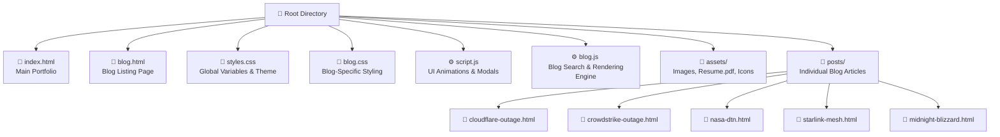

# ⚡ Aniket Rai | Cybersecurity & Engineering Portfolio

A high-performance, responsive personal portfolio website featuring a **Technical Blog**, **Project Showcases**, and **Resume Integration**. Built with a focus on modern aesthetics (Glassmorphism), speed, and "Zero-Database" security.


*(Note: Add a screenshot of your hero section here later)*

---

## 🚀 Key Features

*   **Cybersecurity-First Design**: Dark mode default, efficient layout, and no unnecessary external dependencies.
*   **Engineering Blog**: A custom-built, static blog engine with:
    *   Dynamic Search & Filtering (by tags like *Kernel*, *Space Tech*, *Security*).
    *   Auto-generated Table of Contents.
    *   Dark/Light Mode toggle.
*   **Interactive UI**:
    *   Custom cursor with hover effects.
    *   Scroll-triggered animations (ScrollReveal).
    *   Glassmorphism cards and modals.
*   **Performance**: Pure HTML/CSS/JS. No heavy frameworks (React/Angular) to bloat load times.

---

## 🏗️ Architecture & File Structure

This project uses a **Flat-File Architecture** to ensure maximum security (zero attack surface) and ease of hosting.



---

## 🛠️ Tech Stack

| Component | Technology | Usage |
| :--- | :--- | :--- |
| **Core** | HTML5, CSS3 | Semantic markup and CSS Variables for theming. |
| **Logic** | Vanilla JavaScript (ES6+) | Sorting posts, search filtering, modals, custom cursor. |
| **Typography** | Google Fonts | `Outfit` (Headings) & `Inter` (Body). |
| **Icons** | FontAwesome 6 | Social links and UI elements. |
| **Email** | EmailJS | Contact form submission without a backend server. |

---

## 📖 How to Add a New Blog Post

The blog system allows adding posts without touching a database.

1.  **Create Content**: Copy an existing file in `posts/` (e.g., `template.html`) and update the HTML content.
2.  **Register Post**: Open `blog.js` and add a new entry to the `blogPosts` array:

    ```javascript
    {
        title: "My New Security Findings",
        summary: "A short breakdown of...",
        date: "2025-12-10",
        tags: ["Research", "Malware"],
        link: "posts/new-findings.html"
    }
    ```
3.  **Deploy**: Push to GitHub. The JS engine automatically sorts it by date and adds it to the list.

---

## 🎨 Theme Customization

The site relies on CSS Variables for easy re-theming in `styles.css`:

```css
:root {
    --primary-color: #00f7ff;  /* Cyan Neon */
    --secondary-color: #ff00ff; /* Magenta Neon */
    --bg-main: #0f172a;        /* Deep Slate Background */
}
```

---

## 📬 Contact

**Aniket Rai**  
Cybersecurity Engineer | Cloud & Network Security  
[LinkedIn](https://linkedin.com/in/your-profile) • [GitHub](https://github.com/your-username)
